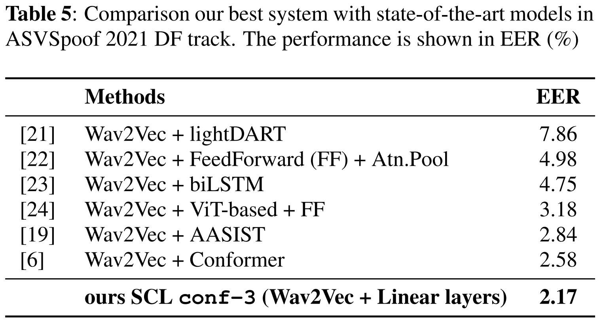

# SCL-Deepfake-audio-detection

This is official implementation of our work **"SYNTHETIC SPEECH DETECTION USING VOCODER SIGNATURE EXTRACTION"**

For the right reserved by the funding organizer, the source code of this model could not be distributed now. We will open it later. For experiment results, please refer to `Result.ipynb`.

Model are deployed in this demo site
[https://deepfake.phucdt.me/](https://deepfake.phucdt.me/). Please contact us for granting access to the demo system.

phucdt[at]soongsil[dot]ac[dot]kr

# Reference
* [SSL_Anti-spoofing](https://github.com/TakHemlata/SSL_Anti-spoofing)
* [project-NN-Pytorch-scripts](https://github.com/nii-yamagishilab/project-NN-Pytorch-scripts)
* [audio_augmentor](https://github.com/josebeo2016/audio_augmentor)
* [SupContrast](https://github.com/HobbitLong/SupContrast)
